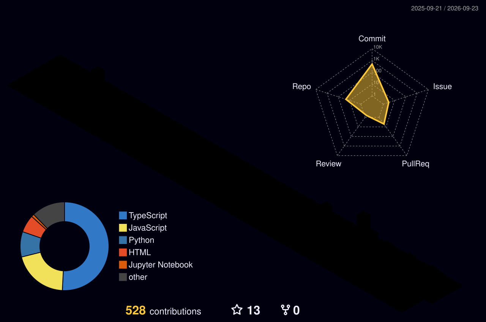

# Hi there, I'm Sushanth! 👋

  

  

---

### 💫 About Me

I am a passionate Front-End Developer and UI/UX Designer studying Computer Science Engineering at GITAM. I love crafting interactive web interfaces, exploring new frontend frameworks, and building smart software utilities.

- 🔭 I’m currently working on **[Compiler Visualizer](https://github.com/P-Sushanth/Compiler_Visualizer)** and **[AI Legislative Analyser](https://github.com/P-Sushanth/AI_Legastive_Analyser)**
- 🌱 I’m currently learning **TypeScript and advanced React patterns**
- 👯 I’m looking to collaborate on **Interactive Web Apps & Open Source Projects**
- 💬 Ask me about **React, JavaScript, Python, and UI/UX Design**
- 📫 How to reach me: **[popurisushanth@gmail.com](mailto:popurisushanth@gmail.com)**
- ⚡ Fun fact: **I code best when listening to Synthwave/Lofi beats 🎧**

---

### 🛠️ Tech Stack & Skills

  <!-- Languages -->
  
  
  
  
  
  
  &nbsp;&nbsp;&nbsp;&nbsp;&nbsp;&nbsp;

  <!-- Frameworks & Libraries -->
  
  
  

  &nbsp;&nbsp;&nbsp;&nbsp;&nbsp;&nbsp;

  <!-- Databases & Cloud / DevOps -->
  
  
  
  

---

### 📊 GitHub Stats & Performance

  
  &nbsp;&nbsp;
  

  
  &nbsp;&nbsp;
  

---

### 🏆 GitHub Trophies & Achievements

  

---

### 🏙️ 3D Contribution Graph

  

---

### ⚡ Recent Activity
<!--START_SECTION:activity-->
<!--END_SECTION:activity-->

---

### 🤝 Connect with me

  
  &nbsp;&nbsp;
  
  &nbsp;&nbsp;
  
  &nbsp;&nbsp;
  

---

  

